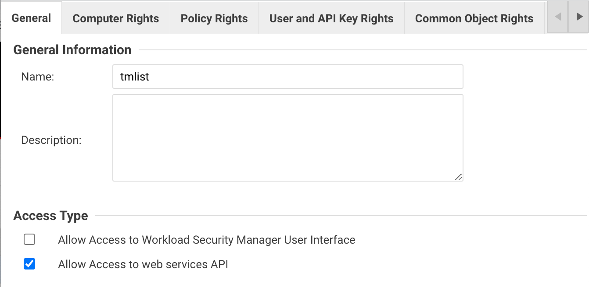
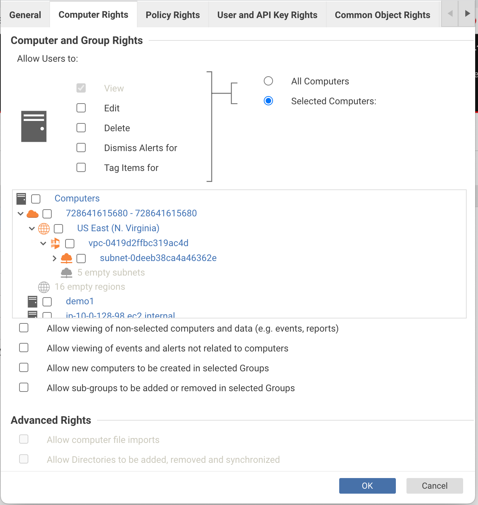
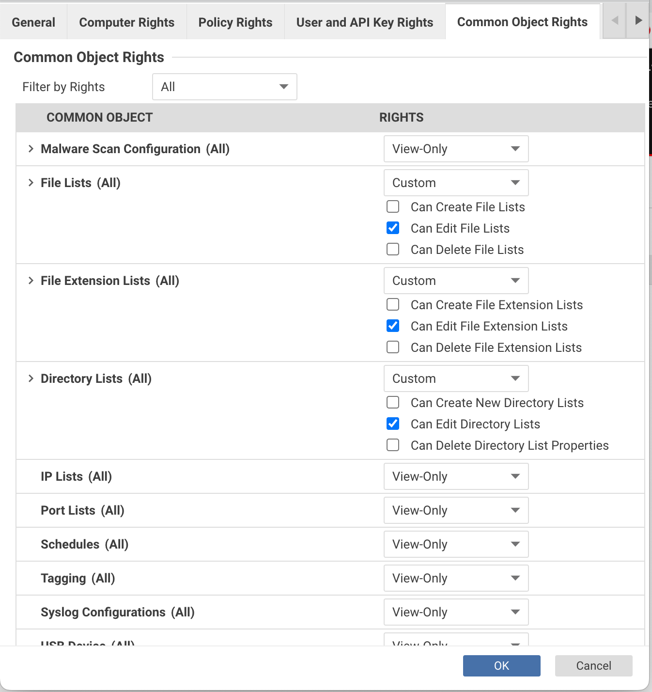
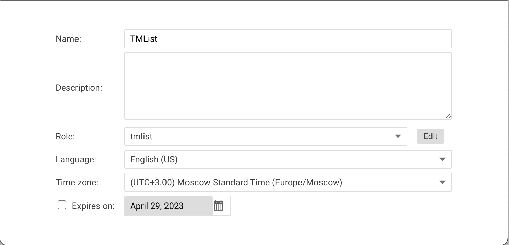

 
# Manage Trend Micro Cloud One Workload Security/Deep Security Lists
 
**Add the ability to include antivirus exclusion lists one into another**
 
## Usage

To use TMList one has to edit exclusion lists, provide API Key, REST API entry point URL, and run the program.

### Get an API Key

Before generating API Key itself, custom role should be created to avoid using default Full Control role.

#### Create a custom restricted role

Open the Cloud One Workload Security (or Deep Security) console.
Go to Administration -> User Management -> Roles.
Click New button
Give the new role a name, e.g., "tmlists" <br/><br/>
Switch to Computer Rights tab. Turn off all rights <br/><br/>
Switch to API Key Rights tab. Pick Custom and do not select any checkboxes <br/><br/>
Switch to Common Object Rights tab. Change the dropdown next to File Lists (All), File Extension Lists (All), and Directory Lists (All) to Full. Custom and check only "Can Edit..." checkbox. <br/><br/>
Press Ok button at the bottom

 
#### Generate API Key

Go to Administration -> User Management -> API Keys.
Click New button
Give the API Key a name, e.g., "tmlists"
In the Role dropdown pick name of the role created on the previous step <br/><br/>
Press Next button
Save the API key to the configuration file (see below)

**Note:** Alternatevly Cloud One API Key can be used with a role that provides Full Control for Endpoint & Workload Security. This approach does not provide appropriate permissions granularity.
 
### Get Entry Point Address
Entry point is URL where program will connect to submit Web API calls

#### For Deep Security users
For Deep Security, address should be the address of one of Deep Security Managers with port that is 4119 by default and /api path:
```
https://<dsm address>:4119/api
```
 
#### For Cloud One Endpoint & Workload Security users

Open Cloud One console
Click your account at the top of the screen and pick Account Settings
Note your Region on the Account Settings Screen

API entry point will be
```
https://workload.<region>.cloudone.trendmicro.com/api
```
 
### Create a configuration file
In the same directory as  TMList executable create file named config.yaml and open it in your favorite text editor.
Fill it with the following content:
```yaml
address: <your API entry point URL>
api_key: <your apy key>
```
 
### Create lists with includes
 
Open Coud One Workload Security (or Deep Security) console. Go to Policies section -> Common Objects -> Lists.
TMList support following lists:

Directory Lists
File Expension Lists
File Lists

To create a list that combines other lists, click New button, provide a name, and go to the description section. Put into description section the following lines:
```
Include: <list name>
Include: <list name>
...
```
Any other lines can be added to the description; they will be ignored by TMList.
 
After TMList is run, this list will be populated with the contents of the specified lists.

**Warning:** The contents of the list with includes will be deleted! After TMList is run it will contain only included lists.

**Note:** Cycle includes are not alowed

## Run

TMList can be run without parameters. For Linux/macOS:
```commandline
./tmlist
```
For Windows:
```commandline
tmlist.exe
```
It will process all the Lists one by one.

## Options

TMList offers three ways to provide options:

1. Configuration file config.yaml. The application seeks for this file in its current folder or in folder of its executable
2. Environment variables
3. Command line parameters

 
The following options are available:
 
| Type | YAML Option<br/>Command line<br/>Env Variable | Description | Default |
| ---- | --------------------------------------------- | ----------- | ------- |
|String|address<br/>--address<br/>TMLIST_ADDRESS|Workload Security entrypoint URL or Deep Security Manager URL|none|
|String|api_key<br/>--api_key<br/>TMLIST_API_KEY|Cloud One or Deep Security API Key|none|
|Boolean|dir<br/>--dir<br/>TMLIST_DIR|Process directory lists|false|
|Boolean|ext<br/>--ext<br/>TMLIST_EXT|Process file extension lists|false|
|Boolean|file<br/>--file<br/>TMLIST_FILE|Process file lists|false|
|Boolean|dry<br/>--dry<br/>TMLIST_DRY|Dry run - do not modify any lists|false|

**Note:** If none of the --dir, --ext or --file options are provided, they all supposed to be true and TMList processes all lists.

**Note:** If the same parameter is provided more than one way, then the following precedence will take place:

1. Environment variables override the configuration file parameters
2. Command line options override both environment variables and configuration file parameters


## Return Codes

If TMList successfully finishes lists modification it returnes code 0. In case of the error, non zero Return Code can be checked to diagnose a problem.

| Return Code | Description |
| ----------- | ----------- |
|0|Ok|
|2|Command line error|
|3|Other error|
|4|API error|
|5|Cycle Dependence|
|6|List Not Found|
