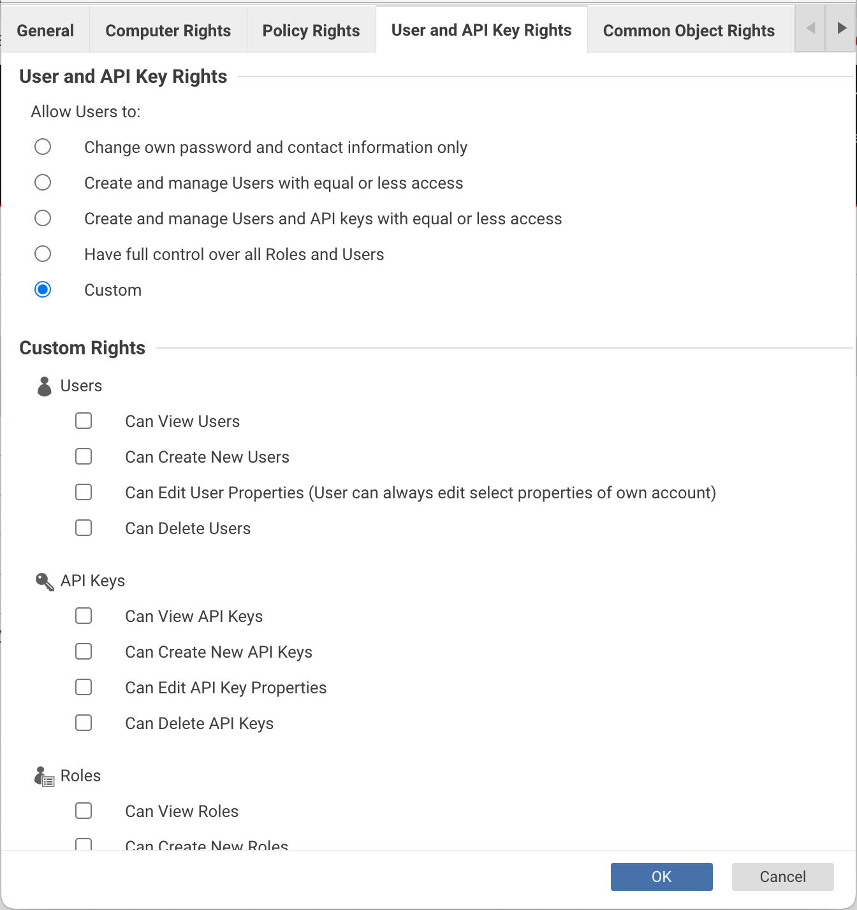

# Manage Trend Micro Cloud One Workload Security/Deep Security Lists

**Add ability to include antivirus exclusion lists one into another**

## Usage

### Get API Key

#### Create Custom Constricted Role
1. Open Coud One Workload Security (or Deep Security) console.
2. Go to Administration -> User Management -> Roles.
3. Click New button
4. Give new role a name, e.g. "tmlists" <br/><br/>
5. Switch to Computer Rights tab. Turn off all rights <br/><br/>
6. Switch to API Key Rights tab. Pick Custom and do not select any checkboxes <br/><br/>
7. Switch to Common Object Rights tab. Change dropdown next to File Lists (All), File Extension Lists (All), and Directory Lists (All) to Full. Custom and check only "Can Edit..." checkbox. <br/><br/>
8. Press Ok button at the bottom

#### Generate API Key
1. Go to Administration -> User Management -> API Keys.
2. Click New button
3. Give API Key a name, e.g. "tmlists"
4. In Role dropdown pick name of role create on previous step <br/><br/>
5. Press Next button
6. Save API key to configuration file (see below)

**Note:** Alternatevly Cloud One API Key can be used with role that provides Full Control for Endpoint & Workload Security. This approach does not provide appropriate permissions granularity.

### Get Entry Point Address
#### For Deep Security users
For Deep Security address should be the address of one of Deep Security Managers with port that is 4119 by default and /api path:
```
https://<dsm address>:4119/api
```

#### For Cloud One Endpoint & Workload Security users
1. Open Cloud One console
2. Click your account at the top of the screen and pick Account Settings
3. Note your Region on Account Settings Screen
API entry point will be 
```
https://workload.<region>.cloudone.trendmicro.com/api
```

### Create configuration file
Aside to TMList executable create file named config.yaml and open in your favorite text editor.
Fill it with the following content:
```yaml
address: <your API entry point URL>
api_key: <your apy key>
```

### Create lists with includes

Open Coud One Workload Security (or Deep Security) console. Go to Policies section -> Common Objects -> Lists.
TMList support following lists:
1. Directory Lists
2. File Expension Lists
3. File Lists

To create list that combines other lists click New button, provide name and go to description section. Put into description section following lines:
```
Include: <list name>
Include: <list name>
...
```
Any other lines can be added to description - they will be ignored by TMList.

After TMList run, this list will be populated with contents of specified lists.

**Warning:** Contents of the list with includes will be deleted! After TMList run it will contain only included lists.

**Note:** Cycle includes are not alowed 

## Run

TMList can be run without parameters. For Linux/macOS:
```commandline
./tmlist
```
For Windows:
```commandline
tmlist.exe
```
It will process all Lists one by one.

## Options

TMList offers three ways to provide options:
1. Configuration file config.yaml. Application seeks for this file in its current folder or in folder of its executable
2. Environment variables
3. Command line parameters

Following options are available:

| Type | YAML Option<br/>Command line<br/>Env Variable | Description | Default |
| ---- | --------------------------------------------- | ----------- | ------- |
|String|address<br/>--address<br/>TMLIST_ADDRESS|Workload Security entrypoint URL or Deep Security Manager URL|none|
|String|api_key<br/>--api_key<br/>TMLIST_API_KEY|Cloud One or Deep Security API Key|none|
|Boolean|dir<br/>--dir<br/>TMLIST_DIR|Process directory lists|false|
|Boolean|ext<br/>--ext<br/>TMLIST_EXT|Process file extension lists|false|
|Boolean|file<br/>--file<br/>TMLIST_FILE|Process file lists|false|
|Boolean|dry<br/>--dry<br/>TMLIST_DRY|Dry run - do not modify any lists|false|

**Note:** If none of --dir, --ext or --file options are provided they all supposed to be true and TMList processes all lists.

**Note:** If same parameter is provided more than one way, then following precedence will take place:
1. Environment variables over configuration file parameters
2. Command parameters line over both environment variables and configuration file

## Return Codes

If TMList successfuly finishes lists modification it returnes code 0. In case of
error, non zero Return Code can be checked to diagnose a problem.

| Return Code | Description |
| ----------- | ----------- |
|0|Ok|
|2|Command line error|
|3|Other error|
|4|API error|
|5|Cycle Dependence|
|6|List Not Found|
